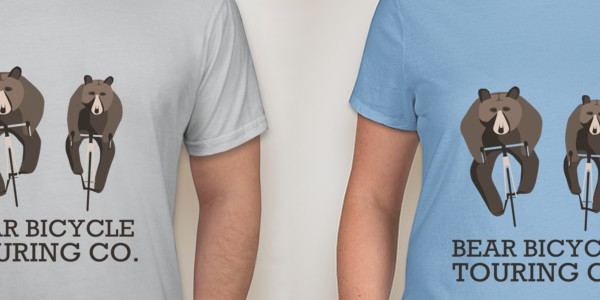

We've been busy
============
[author=Bear Bicycle Touring]

It's been a busy time here at Bear Bicycle Touring Co. If you've been following us on social media, you'll know we've been riding our bikes a lot and exploring some excellent places, but we've been working hard on some exciting developments too.

If you're reading this, you've probably realized that our website has changed somewhat from it's first iteration. We're excited to have this blog space where we can post our thoughts thanks to Alex's dubious web development skills, but also the main content of the site has changed to reflect what's been going on for us recently.

Other than that, the biggest bit of news is that we've decided to add a fairly major addition to our bicycle touring offering: one day or half day tours where we provide you with a bike to ride. In time for the start of June, we'll have a fleet of awesome cyclocross bikes. For this who know what I mean by that, you'll know that they are a great general purpose class of bikes; with the riding style of a road bike but the tires of a bike suited to mixed surfaces, they are good for riding on pretty much any surface apart from technical mountain bike trails. For those who don't know what a cyclocross bike is, don't be put off if they sound a bit too race oriented. We're sure that pretty much anyone can step up to the challenge and take on one of our shorter tours on one of these bikes - you might be amazed how you can ride on a faster bike.

To add to the excitement we've got exclusive teeshirts arriving soon - you'll need to come on a tour with us to buy one! We also have some sweet Bear Bicycle Touring cycling kit coming, thanks to Vie13 Kustom Apparel.

Everything we've been doing recently has been a interesting experience as we've met some pretty interesting people along the way. Without some of them, we wouldn't have got to where we are now:

[Pure Energy Cycling](www.pureenergycycling.com) are a kick-ass bike shop in Lambertville, NJ. As well as being an excellent bike shop, they run a pro women's road racing team and do a load of work supporting the local cycling community. We're pleased to say they are helping us with a number of key things which will go into making this a reality.

We already mentioned [Vie13](www.vie13.com) who are producing bibs and jerseys for us. Another showcase of the excellent local businesses in the area, Vie13 are run by a husband/wife team of world class cycling and speed skating athletes. Their line of cycling gear reflects their background and we couldn't be more excited to be riding in it soon.

Finally, [NJ Bike tours](www.njbiketours.com) is another great local business we've had the pleasure of working with. The founder, Jake was brought up on a bike in Belgium and shares our passion for cycling community and lifestyle. His tours offer a unique farm to table experience of the NJ countryside based out of Princeton and make the perfect day out if you want a more casual day on the bike to experience great locally produced food at NJ farms, vineyard tours, and more.
